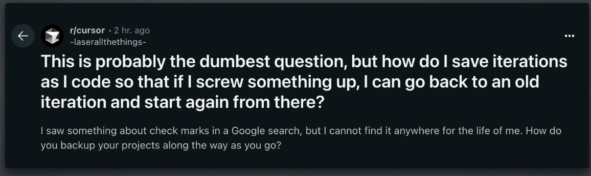

# git-savegame-js README

# Save The Vibe

**Save The Vibe** turns code saving from a chore into a joy.

It's like adding a "save game" button to your coding – simple, fast, and fun.

## Why We Made It

Coding is changing. AI tools are bringing more people to code every day. Vibe coding is great -more and more people can solve problems and be creative. These new tools make mistakes. If you're not familiar with the intracies of git this can ruin your work,

Git and GitHub are great but are quite intimidating.

Save the vibe abstracts away the terminal and typijng in commands in favor of a metaphor everyone knows

##The Save Game Screen

Goals

- Making saving dead simple – one click and you're done
- Showing your saved work in a way that makes sense
- Letting you jump back to any point when things break
- Keeping the tech stuff hidden so you stay in your flow

No commands to learn. No confusion. No stress.

Just save your work, keep your vibe, and code with confidence.

Perfect for students, hobbyists, and anyone who wants to create without the fear of making breaking changes.

## Requirements

git

## Known Issues

Please add any bugs or feature requests in the issues tab. All feedback welcome

## Release Notes

0.0.1 alpha release

Coming soon
We will add summaries of changes in readable text and search

---
