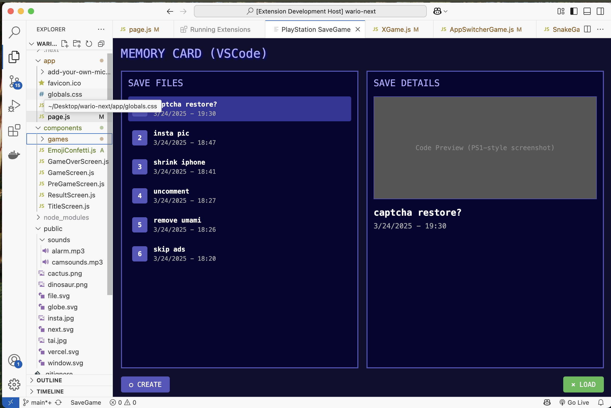

# git-savegame-js README

# Save The Vibe

Vibe coders are running into a problem we've all faced:

Git is complicated

**Save The Vibe** is like adding a "save game" to VSCode

## Why We Made It

Coding is changing. AI tools are bringing more people to code every day. Vibe coding is great -more and more people can solve problems and be creative. However these new tools can make mistakes. If you're not familiar with the intracies of git this can ruin your work,

Git and GitHub are great but an be intimidating.

Save the vibe abstracts away the terminal and typing in commands in favor of a metaphor everyone knows

## The Save Game Screen

Goals

- Making saving dead simple – one click and you're done
- Showing your saved work in a way that makes sense
- Letting you jump back to any point when things break
- Keeping the tech stuff hidden so you stay in your flow

No commands to learn. No confusion. No stress.

Just save your work, keep your vibe, and code with confidence.

## Requirements

git

## Known Issues

Please add any bugs or feature requests in the issues tab. All feedback welcome

## Release Notes

0.0.1 alpha release

Coming soon
We will add summaries of changes in readable text and search

---
